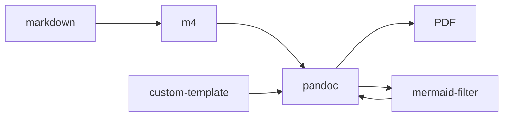

# A Memo About Memos

I am such a weak writer that I can't afford to add bad typography on top of my already flawed writing. I'm so challenged when it comes to aesthetics that, whenever I use a WYSIWYG editor—and I've used many since the early PageMaker days—I spend more time figuring out fonts and paragraph alignment than actually writing. Because I occasionally get to read beautifully typeset documents—and terrible ones most of the time—I can tell the difference and appreciate subtle details such as appropriate hyphenation, justification, kerning, leading, and the use of ligatures.

I write a lot of memos for different audiences, including technical, executive, internal, customer proposals, design analysis, and more. Over the years, I have used various tools to write these memos, such as YODL [@kubat1997yodl], \TeX [@knuth1984texbook], \LaTeX [@latex], DocBook [@docbook], DITA [@dita], AsciiDoc [@asciidoc], AsciiDoctor [@asciidoctor], and of course, Markdown[^1]. After decades of peregrination through different toolchains and editors, including high-end XML editors, nothing beats `vi` (or `emacs` if that's your religion) for fast editing, `Markdown` for ease of use, and \LaTeX \ for perfect typesetting.

While the awesome `pandoc` is the easiest way to convert `Markdown` to a properly typeset `PDF`, the default output, though better than that of many other Markdown editors, is great for occasional memos but doesn't look professional. I've been trying to write a nice `pandoc` template myself without much success, but I recently came across a beautiful one: Eisvogel.[^2]

\begin{mdframed}
This document could end right here: write Markdown and use `pandoc` with the `Eisvogel` template to produce beautiful documents. Period.
\end{mdframed}

However, I believe I can contribute a small addition to the toolchain that will enhance your writing experience and content reuse.



## Required tools

###  TexLive

\TeX Live is a comprehensive distribution of the \TeX \ typesetting system, offering a wide range of \TeX-related software, packages, fonts, and utilities. Maintained by the \TeX \ Users Group, it supports multiple operating systems, including Linux, macOS, and Windows. The live distribution can be found at:  https://www.tug.org/texlive/

### Pandoc

Pandoc is a powerful document converter that supports over a dozen input formats and more than thirty output formats, including Markdown, HTML, \LaTeX, PDF, and Word, making it a perfect fit for our memo toolchain and can be found at https://pandoc.org/

### Mermaid-filter

Mermaid is a versatile tool for creating diagrams and charts from simple text descriptions. It generates flowcharts, sequence diagrams, Gantt charts, and more using an easy-to-learn syntax. Popular in technical documentation and project management, Mermaid integrates seamlessly with various platforms, enhancing documents with clear and visually appealing diagrams. We need the `mermaid-filter` package that gets called from `pandoc`, and can be installed with the command:

`npm i -g mermaid-filter`

### M4

The `m4` macro processor, designed by Brian Kernighan and Dennis Ritchie and originally developed as part of the Unix operating system in the 1970s, is not technically required in this toolchain but is a perfect fit for splitting large documents into smaller pieces, reusing content snippets, and providing standard constants such as the Git revision of the document, date, time, filename, and more. Key features of `m4` include its ability to define macros, perform arithmetic operations, manipulate text with ease, and call the operating system[^3]. It also supports file inclusion, conditional statements, and looping constructs.

As an example, to show the revision of the document, you can insert \verb|«__REVISION__»|, which will be expanded in this case to __REVISION__. The same goes for other variables such as  \verb|«__DATE__»|,  \verb|« __TIME__»|, \verb|«__FILENAME__»|, \verb|« __BRANCH__»| and others that you may want to add to the `memo` script. If you're on Unix, `m4` is probably installed, verify that with the command `type m4`. On Windows, you can install it using Cygwin, or  the Windows Subsystem for Linux (WSL).

### Pandoc template

The Eisvogel template, located at https://github.com/Wandmalfarbe/pandoc-latex-template, has a fantastic set of examples and provides detailed instructions on how to install it. On macOS, with `pandoc` installed via `brew`, the location is `$HOME/.local/share/pandoc/templates` under the name `custom_eisvogel.latex`. It can, of course, be the pristine `eisvogel.latex` script. I suggest calling it `custom_eisvogel.latex` in case you want to add some additional \LaTeX\ commands or configuration.

In that `pandoc/templates` directory, you may also want to add `ieee-with-url.csl` from https://github.com/citation-style-language/styles/blob/master/ieee-with-url.csl or another citation style of your choice.

## The memo script


changequote(`[[', `]]')

```
include(bin/memo)
```

## Frontmatter

This is a sample frontmatter for this document:

```
---
title: A Memo About Memos
subject: Memo Typesetting
author: Alejandro Revilla (\@apr)
date: 2024-07-24
keywords: [Typography]
titlepage: true
# titlepage-logo: jpos.jpg
lang: "en"
toc: true
toc-own-page: true
footer-center: jPOS.org
titlepage-rule-color: "360049"
titlepage-text-color: "FFFFFF"
titlepage-rule-color: "360049"
titlepage-rule-height: 0
titlepage-background: "../backgrounds/background.pdf"
footnotes-pretty: true
header-includes:
  - \usepackage{multicol}
  - \usepackage{mdframed}
  - \usepackage{graphicx}
  - \usepackage{xcolor}
  - \usepackage{pgfplots}
  - \usepackage{amsmath}
  - \pgfplotsset{compat=1.17}
---
```

Note that some of the added packages are used in my custom template, just as a PoC of different features. You can safely remove that `header-includes` section.

## Bibliography

You can add `.bib` file, with the same name as your main `.md` file with the following format:

```
@article{kubat1997yodl,
  title = {YODL or Yet Oneother Document Language},
  author = {Kubat, Karel},
  journal = {Linux Journal},
  year = {1997},
  month = {November},
  number = {2089},
  url = {https://www.linuxjournal.com/article/2089}
}

@manual{docbook,
  title = {DocBook 5.0: The Transition Guide},
  author = {{OASIS DocBook Technical Committee}},
  year = {2010},
  note = {Available online at \url{https://www.docbook.org/tdg5/en/html/docbook.html}},
  url = {https://www.docbook.org/tdg5/en/html/docbook.html}
}

@manual{dita,
  title = {DITA 1.3 Specification},
  author = {{OASIS DITA Technical Committee}},
  year = {2015},
  note = {Available online at \url{https://docs.oasis-open.org/dita/dita/v1.3/os/}},
  url = {https://docs.oasis-open.org/dita/dita/v1.3/os/}
}
...
...
```
changequote(«, »)

## Revision History

esyscmd(git log --pretty=format:'- %ad (`%h`) %s' --date=short __FILENAME__)

[^1]: Disregard the bibliographic references and bookmarks like this; I'm adding them just to show how they look.
[^2]:  https://github.com/Wandmalfarbe/pandoc-latex-template
[^3]:  This poses a security risk when using third-party Markdown sources.

# References

